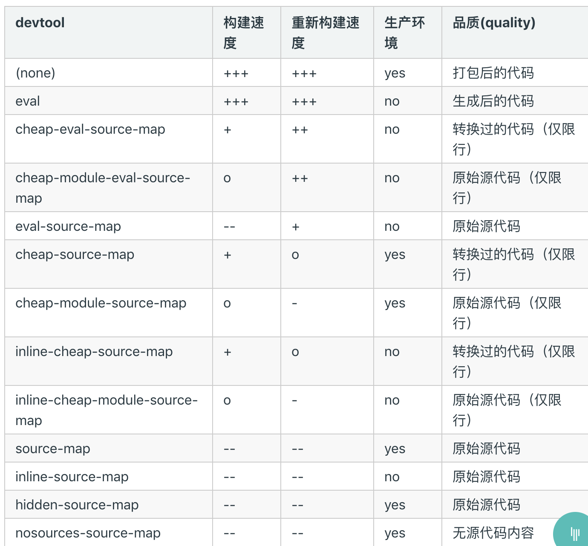

# source-map在webpack的配置方式有两种
1. devtool直接选择配置
2. 你可以直接使用 SourceMapDevToolPlugin/EvalSourceMapDevToolPlugin 来替代使用 devtool 选项，因为它有更多的选项。
**注意**：切勿同时使用 devtool 选项和 SourceMapDevToolPlugin/EvalSourceMapDevToolPlugin 插件。devtool 选项在内部添加过这些插件，所以你最终将应用两次插件。
## 使用devtool配置的情况

经过思考选择两种方案可以只跟踪不暴露
1. `hidden-source-map` - 与 source-map 相同，但不会为 bundle 添加引用注释。如果你只想 source map 映射那些源自错误报告的错误堆栈跟踪信息，但不想为浏览器开发工具暴露你的 source map，这个选项会很有用
**用途**：你不应将 source map 文件部署到 web 服务器。而是只将其用于错误报告工具。
2. `nosources-source-map` - 创建的 source map 不包含 sourcesContent(源代码内容)。它可以用来映射客户端上的堆栈跟踪，而无须暴露所有的源代码。你可以将 source map 文件部署到 web 服务器。
**用途**：这仍然会暴露反编译后的文件名和结构，但它不会暴露原始代码。
**注意**：线上代码是压缩成一行的