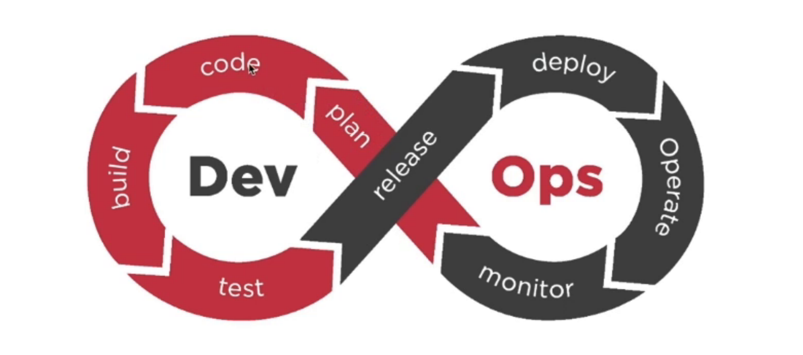
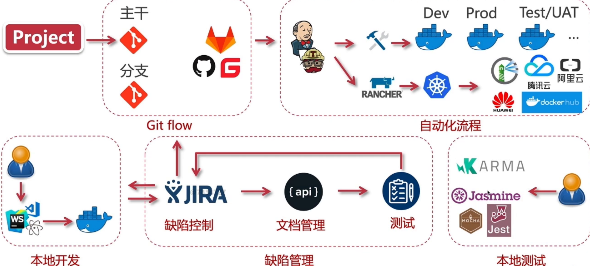

## Devops

### devops是什么？

devops是development和operations的组合词，是一组过程、方法与系统的统称，用于促进开发（应用程序/软件工程）、技术运营和质量保障（QA）部门之间的沟通、协作与整合。总结来说，就是将开发和运维重视沟通，快速自动化的将代码部署到生产中去。

**计划---编码---构建---测试---发布正式版本---部署---操作---监控**

### 为什么需要Devops?

●　开发和运营团队完全孤立。

●　测试和部署是在设计构建之后完成的独立活动。因此，他们比实际构建周期消耗更多时间。

●　在不使用DevOps的情况下，团队成员将大量时间花在测试，部署和设计上，而不是构建项目。

●　手动代码部署会导致生产中出现人为错误

●　开发和运营团队有各自的时间表，不同步导致进一步的延误。

### Devops遵循的原则

1、以客户为中心的行动： DevOps团队必须采取以客户为中心的行动，因为他们应该不断投资于产品和服务。

2、端到端的责任： DevOps团队需要提供性能支持，直到它们终止为止。这提高了产品的责任水平和质量。

3、持续改进： DevOps文化专注于持续改进，以尽量减少浪费。它不断加快提供的产品或服务的改进。

4、自动化一切：自动化是DevOps流程的重要原则。这不仅适用于软件开发，也适用于整个基础架构环境。

5、作为一个团队工作：在DevOps文化角色中，设计人员，开发人员和测试人员已经定义。他们所需要做的就是作为一个团队完成合作。

6、监控和测试所有内容： DevOps团队拥有强大的监控和测试程序非常重要。

## git flow模型

