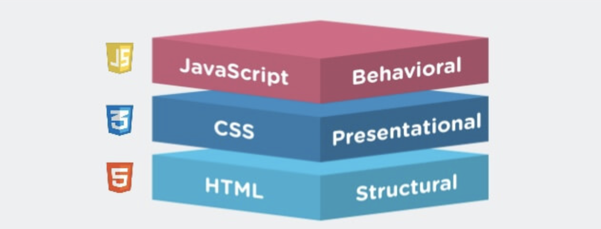

## 一. Javascript应该和HTML，CSS保持怎么样的关系



- HTML 语言：负责网页的结构，又称语义层
- CSS 语言：负责网页的样式，又称视觉层
- JavaScript 语言：负责网页的逻辑和交互，又称逻辑层或交互层

但是在React中，React推崇的是组件结构，也就是要求尽可能的将js,html,css写成一个组件，这样的好处是什么呢？这当然是有利于组件的分离，每个组件包含有需要用到的所有代码，不依赖外部文件，低耦合高内聚，很方便复用。对于js+html混合使用的jsx的混合格式，对于css文件最好的方式就是使用css in js,下面我们来看看css in js的优势有哪些。

## 二. css in js的优势

对于css in js中有几十种库，并且还在不断地发展，但是styled-components和emotion两种做为主流，下面说优势的代码使用styled-components举例。

1. ### css模块化

   尽量降低模块之间的耦合度，利于项目的进一步维护。比起用原生的CSS，这是它首当其冲的优势。

2. ### 支持预处理的语法

对于less,sass在原本的react中需要配置webpack,使用了css in js，完全不需要考虑这些问题。对于嵌套等等便捷的写法很有优势。

```
export const SearchWrapper = styled.div`
  position: relative;
  float: left;
  .zoom {
    right: 5px;
    &.focused {
      background: #777;
      color: #fff;
    }
  }
`;

```

3. ### 让CSS代码能够处理逻辑

不仅仅是因为里面的模板字符串可以写JS表达式，更重要的是能够拿到组件的上下文信息(state、props)

比如,在React组件中的JSX代码中写了这样一段：

```
<RecommendItem imgUrl={'xxx'}/>
复制代码
```

在相应的style.js中就能够接受相应的参数:

```
export const RecommendItem = styled.div`
  width: 280px;
  height: 50px;
  background: url(${(props) => props.imgUrl});
  background-size: contain;
`;
复制代码
```

CSS能够拿到props中的内容，进行相应的渲染，是不是非常酷炫？

4. ### 语义化

拿React组件开发而言，如果要想获得更好的表达力，尽可能的语义化，那怎么办？可能你会暗笑：这还用说，拆组件啊！但组件真的是拆的越细越好吗？

有人曾经说过:当你组件拆的越来越细的时候，你会发现每一个组件就是一个标签。但是这会造成一些更加严重的问题。假设我们拆的都是UI组件，当我们为了语义化连一个button都要封装成一个组件的时候，代码会臃肿不堪，因为会出现数量过于庞大的组件，非常不利于维护。

那，有没有一个折中的方案呢？既能提高标签语义化，又能控制JS文件的数量。 没错，这个方案就是styled-components。

5. ### 兼容性

经发现css in js不用配置webpack能够自动处理浏览器兼容性问题

6. ### css样式组件复用

带有@keyframes的CSS animations，一般来说会产生复用。`styled-components`暴露了一个`keyframes`的API，我们使用它产生一个可以复用的变量。这样，我们在书写css样式的时候使用JavaScript的功能，为CSS附能，并且避免了名称冲突。

```
// keyframes returns a unique name based on a hash of the contents of the keyframes
const rotate360 = keyframes`
  from {
    transform: rotate(0deg);
  }

  to {
    transform: rotate(360deg);
  }
`;

// Here we create a component that will rotate everything we pass in over two seconds
const Rotate = styled.div`
  display: inline-block;
  animation: ${rotate360} 2s linear infinite;
  padding: 2rem 1rem;
  font-size: 1.2rem;
`;

render(
  <Rotate>&lt; 💅 &gt;</Rotate>
);
```

7. ### 很好的支持SSR

   ```
   import { renderToString } from 'react-dom/server'
   import { ServerStyleSheet } from 'styled-components'
   
   const sheet = new ServerStyleSheet()
   const html = renderToString(sheet.collectStyles(<YourApp />))
   const styleTags = sheet.getStyleTags() // or sheet.getStyleElement()
   ```

   也可以这样组件化包裹，只要在客户端不这么使用：

   ```
   import { renderToString } from 'react-dom/server'
   import { ServerStyleSheet, StyleSheetManager } from 'styled-components'
   
   const sheet = new ServerStyleSheet()
   const html = renderToString(
     <StyleSheetManager sheet={sheet.instance}>
       <YourApp />
     </StyleSheetManager>
   )
   
   const styleTags = sheet.getStyleTags() // or sheet.getStyleElement()
   ```

对于Next.js也能够做单独指定规则的渲染。

## 三. 使用style lint规范css in js

### 安装

你需要：

- Stylelint
- 所述[stylelint处理器风格的组件](https://github.com/styled-components/stylelint-processor-styled-components)，以提取从风格样式组件
- 该[stylelint-配置风格的组件](https://github.com/styled-components/stylelint-config-styled-components)，以与冲突禁用stylelint规则样式组件
- 您最喜欢的stylelint配置！（例如[stylelint-config-recommended](https://github.com/stylelint/stylelint-config-recommended)）

**注意**

```
(npm install --save-dev \
  stylelint \
  stylelint-processor-styled-components \
  stylelint-config-styled-components \
  stylelint-config-recommended)
```

### 设定

将.stylelintrc文件添加到项目的根目录：

```
{
  "processors": [
    "stylelint-processor-styled-components"
  ],
  "extends": [
    "stylelint-config-recommended",
    "stylelint-config-styled-components"
  ]
}
```

然后，您需要运行stylelint。在您的package.json中添加一个lint：css脚本，该脚本会使用glob对所有样式化的组件运行stylelint：

```
{
  “scripts” ：{ 
    “ lint：css” ：“ stylelint'./src/**/*.js'”
  }
}
```

**注意**

处理器会忽略不包含任何样式组件的 javascript文件，因此只要将其限制为javascript（或TypeScript），就不必担心它太宽。

现在，您可以通过运行脚本来整理CSS！🎉

```
npm run lint ：css
```

**注意**

请注意，由于Stylelint自定义处理器可能的限制，不支持--fix选项