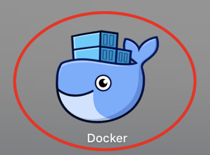

# Docker深入浅出

 * [Docker深入浅出](#docker深入浅出)
      * [Apache和nginx,tomcat,node.js的关系](#apache和nginxtomcatnodejs的关系)
      * [Docker和应用服务器tomcat等的关系](#docker和应用服务器tomcat等的关系)
      * [Docker的八种用途](#docker的八种用途)
      * [Docker的三个概念](#docker的三个概念)
      * [Docker安装](#docker安装)
      * [Docker的使用](#docker的使用)


## Apache和nginx,tomcat,node.js的关系

**nginx和apache是server。tomcat是implementation。node.js是runtime**

*1.runtime*

- 这里的runtime实际上指的是runtime environment—运行时环境。
  runtime是指程序生命周期的一个时态，程序在运行过程中的时候为runtime。程序在编译过程中的时候为compiletime。

- 以前js的运行时环境是在浏览器里比如ie。chrome。firefox。safari等。现在又多出来了一个运行时环境node.js它提供了比如系统io、进程管理等原先运行时不开放的功能所以js能够实现很多以前并不能实现的功能。如express这种web application framework。
- 但是使用node.js实现的应用并不一定都是网络应用，比如electron。

*2.tomcat*

- tomcat是java的应用服务器。
- tomcat就是一个Java Servlet容器，换个说法就是基于java的CGI动态页面服务器，静态页面只是一个附属功能。

*3.server*

- Nginx和Apache是web服务器，不具备解析动态语言（比如php文件和js文件）的能力；能够解析这些脚本语言的程序叫应用服务器，比如Tomcat，Nodejs。

***总结***：简单点理解，Apache = Nginx，相当于微软的IIS；tomcat=Apache+jsp解析器；Node.js只是JavaScript解析器，但可以自己写个js监听80端口解析HTTP协议，那就能等同于Apache和Nginx了，功能和性能那估计没得比。

## Docker和应用服务器tomcat等的关系

1、docker 是容器，tomcat是jsp应用服务器
2、tomcat可以安装在物理机上，虚拟机上，也可以安装在Docker上。所以从这个角度讲，Docker也可以看做是一种超轻量化的虚拟机。
3、Docker可以安装在物理机，虚拟机上，但不知道Docker上面是否可以再安装Docker，我觉得理论上应该可以。
4、Docker作为超轻量级的平台，可以整体移植，这也是它流行的其中一个原因。

Docker 提供轻量的虚拟化，你能够从Docker获得一个额外抽象层，你能够在单台机器上运行多个Docker微容器，而每个微容器里都有一个微服务或独立应用，例如你可以将Tomcat运行在一个Docker，而MySQL运行在另外一个Docker，两者可以运行在同一个服务器，或多个服务器上。未来可能每个应用都要Docker化。

## Docker的八种用途

　　Docker 提供轻量的虚拟化，你能够从Docker获得一个额外抽象层，你能够在单台机器上运行多个Docker微容器，而每个微容器里都有一个微服务或独立应用，例如你可以将Tomcat运行在一个Docker，而MySQL运行在另外一个Docker，两者可以运行在同一个服务器，或多个服务器上。未来可能每个应用都要Docker化。

容器的启动和关系是非常快速的。Docker目前能够有以下八种用途：

- 简化配置

这是Docker初始目的，虚拟机VM最大的好处是基于你的应用配置能够无缝运行在任何平台上。Docker提供同样类似VM的能力，但是没有任何副作用，它能让你将环境和配置放入代码然后部署，同样的Docker配置能够在各种环境中使用，这实际是将应用环境和底层环境实现了解耦。

 

- 代码管道化管理

能够对代码以流式pipeline管道化进行管理，从开发者的机器到生产环境机器这个流程中都能有效管理。因为在这个流程中会有各种不同的环境，每个都可能有微小的区别，Docker提供了跨越这些异构环境以一致性的微环境，从开发到部署实现流畅发布。

 

- 开发人员的生产化

在一个开发环境，我们希望我们的开发环境能更加接近于生产环境，我们会让每个服务运行在自己的VM中，这样能模拟生产环境，比如有时我们并不总是需要跨越网络连接，这样我们可以将多个Docker装载一系列服务运行在单机上最大程度模拟生产分布式部署的环境。

 

* 应用隔离

有很多理由你需要在一台机器上运行多个应用，这就需要将原来铁板一块monolithic的应用切分为很多微服务。实现应用之间的解耦，将多个应用服务部署在多个Docker中能轻松达到这个目的。

 

* 服务合并

使用Docker也能合并多个服务以降低费用，不多的操作系统内存占用，跨实例共享多个空闲的内存，这些技术Docker能以更加紧密资源提供更有效的服务合并。

##  

* 多租户

Docker能够作为云计算的多租户容器，使用Docker能容易为每个租户创建运行应该多个实例，这得益其灵活的快速环境以及有效diff命令。

##  

* 快速部署

Docker通过创建流程的容器，不必重新启动操作系统，几秒内能关闭，你可以在数据中心创建或销毁资源，不用担心额外消耗。典型的数据中心利用率是30%，通过更积极的资源分配，以低成本方式对一个新的实例实现一个更聚合的资源分配，我们很容易超过这个利用率，大大提高数据中心的利用效率。

 


## Docker的三个概念

1. 镜像（Image）：类似于虚拟机中的镜像，是一个包含有文件系统的面向Docker引擎的只读模板。任何应用程序运行都需要环境，而镜像就是用来提供这种运行环境的。例如一个Ubuntu镜像就是一个包含Ubuntu操作系统环境的模板，同理在该镜像上装上Apache软件，就可以称为Apache镜像。

2. 容器（Container）：类似于一个轻量级的沙盒，可以将其看作一个极简的Linux系统环境（包括root权限、进程空间、用户空间和网络空间等），以及运行在其中的应用程序。Docker引擎利用容器来运行、隔离各个应用。容器是镜像创建的应用实例，可以创建、启动、停止、删除容器，各个容器之间是是相互隔离的，互不影响。注意：镜像本身是只读的，容器从镜像启动时，Docker在镜像的上层创建一个可写层，镜像本身不变。

3. 仓库（Repository）：类似于代码仓库，这里是镜像仓库，是Docker用来集中存放镜像文件的地方。注意与注册服务器（Registry）的区别：注册服务器是存放仓库的地方，一般会有多个仓库；而仓库是存放镜像的地方，一般每个仓库存放一类镜像，每个镜像利用tag进行区分，比如Ubuntu仓库存放有多个版本（12.04、14.04等）的Ubuntu镜像。

## Docker安装

各种系统安装方式不尽相同：[docker安装方式](https://yeasy.gitbooks.io/docker_practice/install/mac.html)

mac中可以使用homebrew安装（`brew cask install docker`），虽然很容易失败，那就选择.dmg格式安装。安装完成后，出现docker图标



安装完成后，就可以测试docker命令了。

```javascript
docker --version//测试版本

docker run -d -p 80:80 --name webserver nginx//在本地跑一个webserver名字的nginx服务
```

docker info : 显示 Docker 系统信息，包括镜像和容器数。。

```
docker info
```

没配置镜像的情况


刚开始安装的时候是没有拉取镜像的，并且国外镜像很慢，这时候需要自己配置一下国内的镜像。选用网易的镜像配置

<u>在任务栏点击 Docker for mac 应用图标 -> Perferences... -> Daemon -> Registry mirrors</u>

然后将`http://hub-mirror.c.163.com`配置，具体可以参考[docker配置国内镜像](https://www.runoob.com/docker/macos-docker-install.html)

配置完成使用docker info看镜像变化


## Docker的使用

```javascript
//创建一个镜像为ubuntu:15.10的容器（本地没有就去仓库拉取），执行命令`/bin/echo "Hello world" `
docker run ubuntu:15.10 /bin/echo "Hello world" 

//我们通过 docker 的两个参数 -i -t，让 docker 运行的容器实现"对话"的能力,
  //-t允许新容器创建伪终端或终端，
  //-i允许对容器进行标准输入输出
docker run -i -t ubuntu:15.10 /bin/bash

//我们尝试在容器中运行命令 cat /proc/version和ls分别查看当前系统的版本信息和当前目录下的文件列表
//其实和unbuntu中看到的内容是一样的。使用exit退出
cat /proc/version
ls

//使用以下命令创建一个以进程方式运行的容器
//但是不会打印hello world打印一个容器Id，相当于就是后台进程
docker run -d ubuntu:15.10 /bin/sh -c "while true; do echo hello world; sleep 1; done"

//使用docker ps能够查出后台进程详细信息
docker ps

//使用docker logs names/docker_id查看指定容器里面的执行结果
docker logs 47ba0c7e88

//使用docker stop 容器名停止后台进程
docker stop names1
```

具体细节操作参考下面的资料

* [docker菜鸟教程](https://www.runoob.com/docker/docker-tutorial.html)

* [docker部署前后端](https://zhuanlan.zhihu.com/p/39241059)
* [docker文档gitbook](https://yeasy.gitbooks.io/docker_practice/)