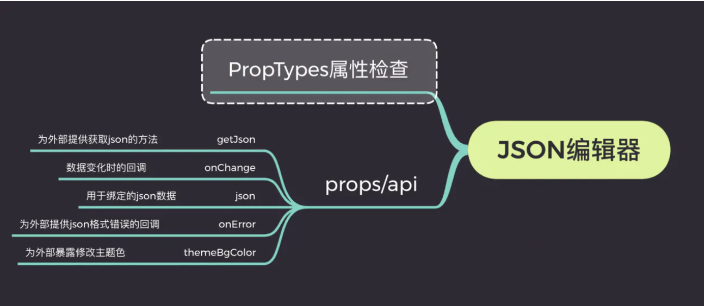
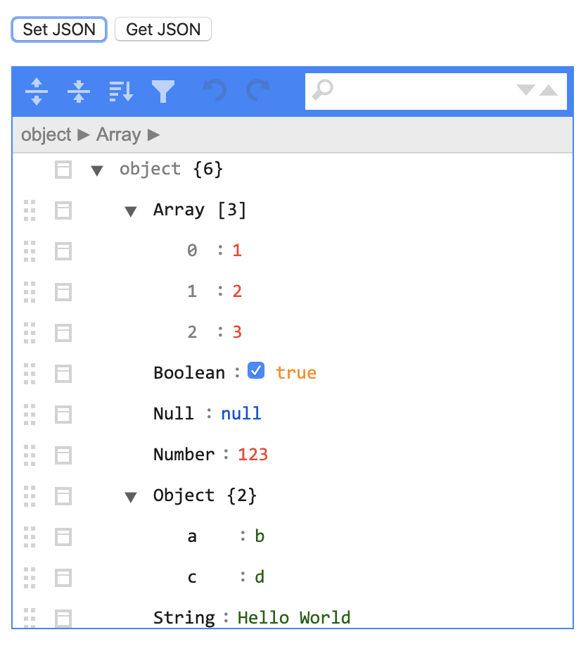
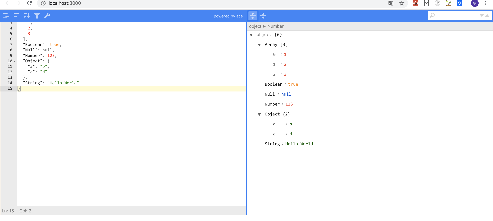

   * [手把手跟着设计一个自定义json编辑器](#手把手跟着设计一个自定义json编辑器)  
         * [设计一个实时编辑器思路](#设计一个实时编辑器思路)   
         * [使用jsoneditor](#使用jsoneditor)   
         * [使用react二次封装](#使用react二次封装)   
         * [针对更多场景改造](#针对更多场景改造)   
      * [参考资料](#参考资料)   

# 手把手跟着设计一个自定义json编辑器

### 设计一个实时编辑器思路



### 使用jsoneditor

本想借助网上资料自己从头撸一个json编辑器，但是奈何太菜，所以只有跟着改造一下json编辑器，首先借助一个基础的j son解析的编辑器[json编辑器文档](https://github.com/josdejong/jsoneditor/blob/master/docs/usage.md)

按照文档先跑起来一个json基础编辑器

```
npm install jsoneditor
```

然后引用jsoneditor包中的js问价和css文件

```
<link href="jsoneditor/dist/jsoneditor.min.css" rel="stylesheet" type="text/css">
<script src="jsoneditor/dist/jsoneditor.min.js"></script>
```

然后就可以创建一个标签作为editor的容器

```
<div id="jsoneditor" style="width: 400px; height: 400px;"></div>
```

加载容器标签后，再使用javascript加载editor内容，并且创建在容器标签中

```
var container = document.getElementById("jsoneditor");
var options = {
    mode: 'tree'
};
var editor = new JSONEditor(container, options);
```

给容器设置json数据

```
editor.set(json);
```

获取指定editor的json数据

```
var json = editor.get();
```

一个基本的编辑器就跑出来了，但是这还不够,需要自己多样化



### 使用react二次封装

App.js代码

```
import React, { Component } from 'react'
import JsonEditor from './JsonEditor';
import 'jsoneditor/dist/jsoneditor.css';

import './App.css';
export default class App extends Component {
    constructor(props){
        super(props)
        this.state={
            data:
            {
              "Array": [1, 2, 3],
              "Boolean": true,
              "Null": null,
              "Number": 123,
              "Object": {"a": "b", "c": "d"},
              "String": "Hello World"
          }
        }
    }
    render() {
        return (
            <div>
                <JsonEditor value={this.state.data}/>
            </div>
        )
    }
}

```


JsonEditor代码

```
import React, { PureComponent } from 'react'
import JSONEditor from 'jsoneditor'

import 'jsoneditor/dist/jsoneditor.css'

class JsonEditor extends PureComponent {
  onChange = () => {
    let value = this.jsoneditor.get()
    this.viewJsoneditor.set(value)
  }

  initJsonEditor = () => {
    const options = {
      mode: 'code',
      history: true
    };

    this.jsoneditor = new JSONEditor(this.container, options)
    this.jsoneditor.set(this.props.value)
  }

  initViewJsonEditor = () => {
    const options = {
      mode: 'view'
    };

    this.viewJsoneditor = new JSONEditor(this.viewContainer, options)
    this.viewJsoneditor.set(this.props.value)
  }

  componentDidMount () {
    this.initJsonEditor()
    this.initViewJsonEditor()
  }

  componentDidUpdate() {
    if(this.jsoneditor) {
      this.jsoneditor.update(this.props.value)
      this.viewJsoneditor.update(this.props.value)
    }
  }

  render() {
    return (
      <div className="jsonEditWrap">
        <div className="jsoneditor-react-container" ref={elem => this.container = elem} />
        <div className="jsoneditor-react-container" ref={elem => this.viewContainer = elem} />
      </div>
    );
  }
}

export default JsonEditor

```

效果图:



### 针对更多场景改造

```
import React, { PureComponent } from 'react'
import JSONEditor from 'jsoneditor'
import PropTypes from 'prop-types'
import 'jsoneditor/dist/jsoneditor.css'

/**
 * JsonEditor
 * @param {object} json 用于绑定的json数据
 * @param {func} onChange 变化时的回调
 * @param {func} getJson 为外部提供回去json的方法
 * @param {func} onError 为外部提供json格式错误的回调
 * @param {string} themeBgColor 为外部暴露修改主题色
 */
class JsonEditor extends PureComponent {
  onChange = () => {
    let value = this.jsoneditor.get()
    this.props.onChange && this.props.onChange(value)
    this.viewJsoneditor.set(value)
  }

  getJson = () => {
    this.props.getJson && this.props.getJson(this.jsoneditor.get())
  }

  onError = (errArr) => {
    this.props.onError && this.props.onError(errArr)
  }

  initJsonEditor = () => {
    const options = {
      mode: 'code',
      history: true,
      onChange: this.onChange,
      onValidationError: this.onError
    };

    this.jsoneditor = new JSONEditor(this.container, options)
    this.jsoneditor.set(this.props.value)
  }

  initViewJsonEditor = () => {
    const options = {
      mode: 'view'
    };

    this.viewJsoneditor = new JSONEditor(this.viewContainer, options)
    this.viewJsoneditor.set(this.props.value)
  }

  componentDidMount () {
    this.initJsonEditor()
    this.initViewJsonEditor()
    // 设置主题色
    this.container.querySelector('.jsoneditor-menu').style.backgroundColor = this.props.themeBgColor
    this.container.querySelector('.jsoneditor').style.border = `thin solid ${this.props.themeBgColor}`
    this.viewContainer.querySelector('.jsoneditor-menu').style.backgroundColor = this.props.themeBgColor
    this.viewContainer.querySelector('.jsoneditor').style.border = `thin solid ${this.props.themeBgColor}`
  }

  componentWillUnmount () {
    if (this.jsoneditor) {
      this.jsoneditor.destroy()
      this.viewJsoneditor.destroy()
    }
  }

  componentDidUpdate() {
    if(this.jsoneditor) {
      this.jsoneditor.update(this.props.value)
      this.viewJsoneditor.update(this.props.value)
    }
  }

  render() {
    return (
      <div className="jsonEditWrap">
        <div className="jsoneditor-react-container" ref={elem => this.container = elem} />
        <div className="jsoneditor-react-container" ref={elem => this.viewContainer = elem} />
      </div>
    );
  }
}

JsonEditor.propTypes = {
  json: PropTypes.object,
  onChange: PropTypes.func,
  getJson: PropTypes.func,
  onError: PropTypes.func,
  themeBgColor: PropTypes.string
}

export default JsonEditor

```


## 参考资料

[掘金资料](https://juejin.im/post/5e302af8e51d453cc04abc56?utm_source=gold_browser_extension)
