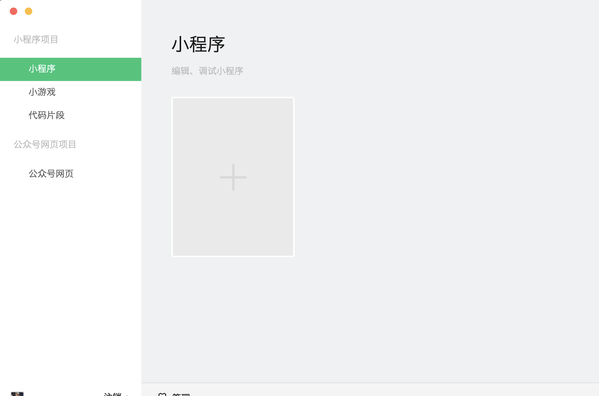
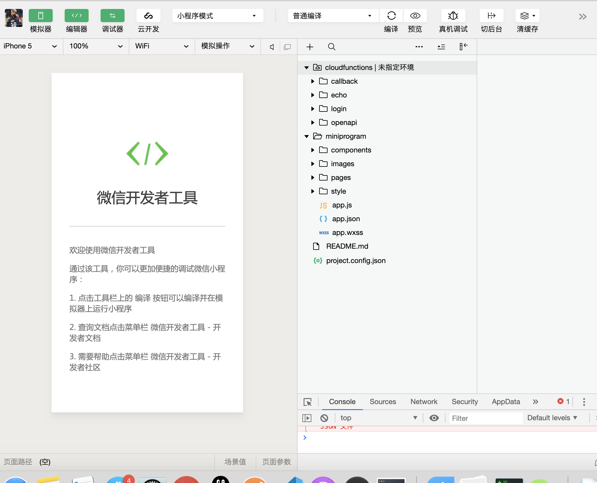

##   什么是微信小程序？

### 微信小程序的优点：

* 不需要下载安装即可使用（大小大约在1M，下载很快）
* 用户用完即走，不用关心是否安装太多应用
* 应用无处不在，随时使用（人与服务）

1. 淘宝（人与商品）
2. 微信（人与人）
3. 微信小程序（人与服务）

### 与传统APP相比较：

流程简单，体验好

跨平台，成本低

性能较差，不如安卓，IOS基于操作系统上面。

### 微信小程序和普通网页开发的区别

小程序的主要开发语言是 JavaScript ，小程序的开发同普通的网页开发相比有很大的相似性。对于前端开发者而言，从网页开发迁移到小程序的开发成本并不高，但是二者还是有些许区别的。

网页开发渲染线程和脚本线程是互斥的，这也是为什么长时间的脚本运行可能会导致页面失去响应，而在小程序中，二者是分开的，分别运行在不同的线程中。网页开发者可以使用到各种浏览器暴露出来的 DOM API，进行 DOM 选中和操作。而如上文所述，小程序的逻辑层和渲染层是分开的，逻辑层运行在 JSCore 中，并没有一个完整浏览器对象，因而缺少相关的DOM API和BOM API。这一区别导致了前端开发非常熟悉的一些库，例如 jQuery、 Zepto 等，在小程序中是无法运行的。同时 JSCore 的环境同 NodeJS 环境也是不尽相同，所以一些 NPM 的包在小程序中也是无法运行的。

网页开发者需要面对的环境是各式各样的浏览器，PC 端需要面对 IE、Chrome、QQ浏览器等，在移动端需要面对Safari、Chrome以及 iOS、Android 系统中的各式 WebView 。而小程序开发过程中需要面对的是两大操作系统 iOS 和 Android 的微信客户端，以及用于辅助开发的小程序开发者工具，小程序中三大运行环境也是有所区别的，如表所示的。

| **运行环境**     | **逻辑层**     | **渲染层**       |
| :--------------- | :------------- | :--------------- |
| iOS              | JavaScriptCore | WKWebView        |
| 安卓             | V8             | chromium定制内核 |
| 小程序开发者工具 | NWJS           | Chrome WebView   |

### 微信小程序的使用场景：

* 适合做简单的，用完即走的应用
* 小程序适合低频的应用
* 适合做性能要求不高的应用

例子：知乎不适合，因为需要很久停留，需要信息推送

## 开发准备

1. 申请App_id（微信公众平台以个人身份注册，根据里面的文档进行开发）

2. 下载并安装微信开发者工具

​					3.source断点调试

view做容器和分隔,text长按住复制

Rpx(可以根据手机响应变化,px固定的不会根据变化，强行使用px（同一个设备），使用二倍换算关系)，json文件，路径

css语法（大部分支持）

弹性布局

px和rpx换算固定换算